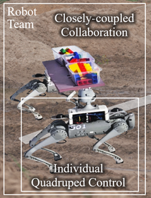
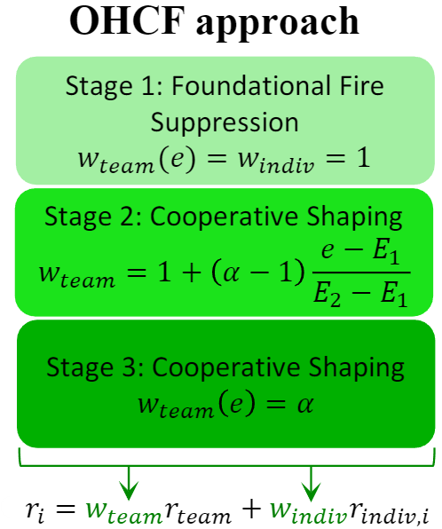
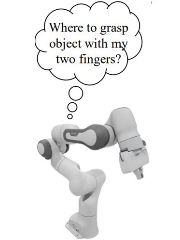
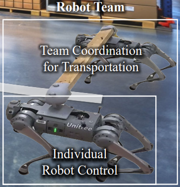
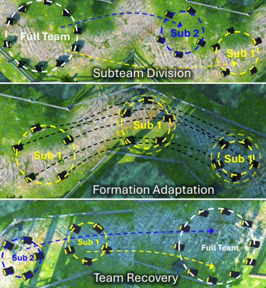
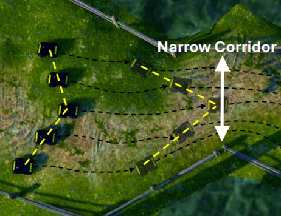
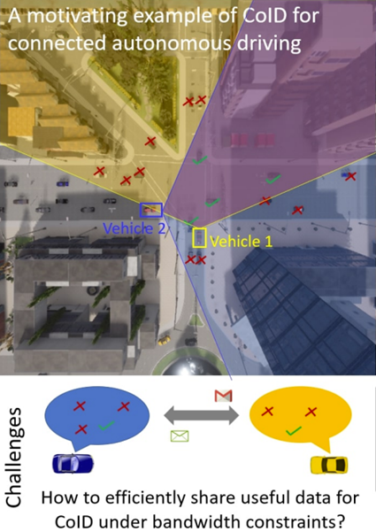
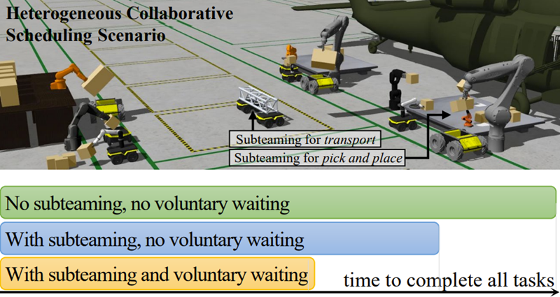
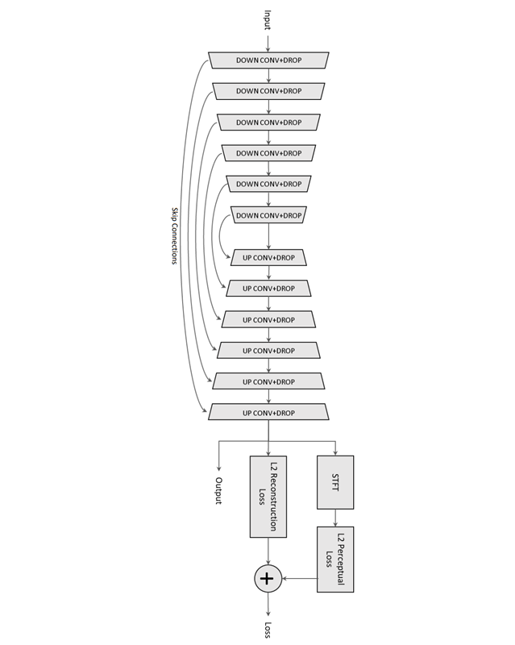
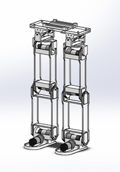

I am a PhD student in Computer Science (Robotics) from [University of Massachusetts Amherst](https://www.umass.edu/). I am advised by [Dr. Hao Zhang](https://www.cics.umass.edu/about/directory/hao-zhang) at the [Human-Centered Robotics Lab](https://hcr.cs.umass.edu/). 
My research broadly focuses on improving multi-robot collaboration and adaptation using learning methods such as multi-agent reinforcement learning, diffusion policy, and flow matching. 
Specific research problems include tightly coupled physical collaboration among multiple legged and wheeled robots and devising scalable methods for multi-robot task allocation and scheduling. 
More recently, I have been exploring new approaches to resolving conflicts between the team-level objectives and individual-level robot objectives. 

Before UMass, I was a Lead AI Engineer at [Samsung Research](https://research.samsung.com/) (currently on leave). I received my undergraduate degree in Electronics and Communications Engineering from [University of the Philippines](http://up.edu.ph/). 

## News
* **2025-10** My [third US patent](https://patents.google.com/patent/US12437673B2) with collaborators from Samsung Research was granted
* **2025-08** [One paper](https://hcrlab.gitlab.io/project/STAF/) accepted to CoRL'25
* **2025-03** My [second US patent](https://patents.google.com/patent/US12262344B2) with collaborators from Samsung Research was granted
* **2025-01** Two papers ([paper1](https://hcrlab.gitlab.io/project/afor/), [paper2](https://hcrlab.gitlab.io/project/acoid/)) accepted to ICRA'25
* **2024-05** Our ICRA'24 paper was a finalist for the best paper award in multi-robot systems
* **2024-01** [One paper](https://hcrlab.gitlab.io/project/lvws/) accepted to ICRA'24
* **2022-11** My [first US patent](https://patents.google.com/patent/US11508394B2) as sole inventor from Samsung Research was granted
* **2022-09** Started MS/PhD Computer Science at University of Massachusetts Amherst

## Publications

  
You can also find my publications on <a href="{{site.author.googlescholar}}">my Google Scholar profile</a>.



<table style="width:100%;border:0px;border-width:0px;border-spacing:0px;border-collapse:separate;margin-right:auto;margin-left:auto;"><tbody>
  <tr>
    <td style="border:none;padding:16px;width:20%;vertical-align:middle">
      
    </td>
    <td style="border:none;padding:8px;width:80%;vertical-align:middle">
      <strong>Collaborative Quadruped Transportation in 3D Terrain with Constrained Diffusion</strong>
       
      <u>Williard Joshua Jose</u>, Li Chen, Hao Zhang
       
      <em>Under review</em>
       
      <a href="../project/cqtd/static/cqtd.pdf">Paper</a>
      |
      <a href="https://williard.xyz/project/cqtd/">Page</a>
      

      

      We present Collaborative Quadruped Transportation with Constrained Diffusion (CQTD), enabling a team of closely coupled quadruped robots to collaboratively transport a payload across 3D terrain. 
      A diffusion-based upper level learns terrain-aware team-level trajectories satisfying team kinematic constraints due to the payload coupling, while a lower level optimizes velocity controls of individual robots satisfying collision and anisotropic velocity constraints. 
      

    </td>
  </tr>
  <tr>
    <td style="border:none;padding:16px;width:20%;vertical-align:middle">
      
    </td>
    <td style="border:none;padding:8px;width:80%;vertical-align:middle">
      <strong>Harmonizing Team and Individual Goals in Decentralized Multi-Robot Fire Suppression through Curriculum Reinforcement Learning</strong>
       
      <u>Williard Joshua Jose</u>, Yuhao Li, Hao Zhang
       
      <em>Under review</em>
       
      <a href="../project/ohcf/static/ohcf.pdf">Paper</a>
      |
      <a href="https://icra-ohcf.github.io/">Page</a>
      

      

      We propose Objective Harmonization Curriculum for Fire Suppression (OHCF), a method that integrates curriculum learning with multi-agent reinforcement learning (MARL). 
      We design a novel three-stage curriculum that guides the learning process by initially prioritizing individual objectives to build foundational skills, then gradually shifting the reward structure to emphasize the collective goal, and finally refining the policy to optimize efficient team coordination.
      

    </td>
  </tr>
  <tr>
    <td style="border:none;padding:16px;width:20%;vertical-align:middle">
      
    </td>
    <td style="border:none;padding:8px;width:80%;vertical-align:middle">
      <strong>EdgeGrasper: Fast Polygon Segmentation-Based Grasp Detection</strong>
       
      <u>Williard Joshua Jose</u>, Bertram David Matabang, Joemer Aliman, Michel Onasis Ogbinar, Rowel Atienza
       
      <em>Under review</em>
       
      <a href="../project/edgegrasper/static/edgegrasper.pdf">Paper</a>
      |
      <a href="https://williard.xyz/project/edgegrasper/">Page</a>
      

      

      We propose EdgeGrasper, a fast polygon segmentation-based grasp detection network that leverages the edges of an instance segmentation efficiently produce grasping point candidates. 
      EdgeGrasper defines grasp detection candidates using pairs of vertices of the polygon representing the instance segmentation of the object, where the midpoint, orientation, and distance of the pair of points directly define the grasp.
      

    </td>
  </tr>
  <tr>
    <td style="border:none;padding:16px;width:20%;vertical-align:middle">
      
    </td>
    <td style="border:none;padding:8px;width:80%;vertical-align:middle">
      <strong>Bilevel Learning for Dual-Quadruped Collaborative Transportation under Kinematic and Anisotropic Velocity Constraints</strong>
       
      <u>Williard Joshua Jose</u>, Hao Zhang
       
      <em>Under review</em>
       
      <a href="https://arxiv.org/abs/2412.08644">Paper</a>
      |
      <a href="https://hcrlab.gitlab.io/project/blct/">Page</a>
      

      

      We propose a novel Bilevel Learning for Collaborative Transportation (BLCT) approach. 
      In the upper-level, BLCT learns a team collaboration policy for the two quadruped robots to move the payload to the goal position, while accounting for the kinematic constraints imposed by their connection to the payload. 
      In the lower-level, BLCT optimizes velocity controls of each individual robot to closely follow the collaboration policy while satisfying the anisotropic velocity constraints and avoiding obstacles. 
      

    </td>
  </tr>
  <tr>
    <td style="border:none;padding:16px;width:20%;vertical-align:middle">
      
    </td>
    <td style="border:none;padding:8px;width:80%;vertical-align:middle">
      <strong>Subteaming and Adaptive Formation Control for Coordinated Multi-Robot Navigation</strong>
       
      Zihao Deng, Peng Gao, <u>Williard Joshua Jose</u>, Maggie Wigness, John Rogers, Brian Reily, Christopher Reardon, Hao Zhang
       
      <em>Conference on Robot Learning</em>, 2025
       
      <a href="https://proceedings.mlr.press/v305/deng25b.html">Paper</a>
      |
      <a href="https://hcrlab.gitlab.io/project/STAF/">Page</a>
      

      

      We introduce a novel method for SubTeaming and Adaptive Formation (STAF) to enable coordinated multi-robot navigation in complex and challenging scenarios. 
      STAF is built upon a unified hierarchical learning framework that incorporates (1) high-level deep graph cut, (2) intermediate-level graph learning, and (3) low-level policy learning. 
      

    </td>
  </tr>
  <tr>
    <td style="border:none;padding:16px;width:20%;vertical-align:middle">
      
    </td>
    <td style="border:none;padding:8px;width:80%;vertical-align:middle">
      <strong>Coordinated Multi-Robot Navigation with Formation Adaptation</strong>
       
      Zihao Deng, Peng Gao, <u>Williard Joshua Jose</u>, Christopher Reardon, Maggie Wigness, John Rogers, Hao Zhang
       
      <em>IEEE International Conference on Robotics and Automation</em>, 2025
       
      <a href="https://ieeexplore.ieee.org/document/11128457/">Paper</a>
      |
      <a href="https://hcrlab.gitlab.io/project/afor/">Page</a>
      

      

      We introduce a novel Adaptive Formation with Oscillation Reduction (AFOR) approach to improve coordinated multi-robot navigation. 
      We develop AFOR under the theoretical framework of hierarchical learning and integrate a spring-damper model with hierarchical learning to enable both team coordination and individual robot control.
      

    </td>
  </tr>
  <tr>
    <td style="border:none;padding:16px;width:20%;vertical-align:middle">
      
    </td>
    <td style="border:none;padding:8px;width:80%;vertical-align:middle">
      <strong>Bandwidth-Adaptive Spatiotemporal Correspondence Identification for Collaborative Perception </strong>
       
      Peng Gao, <u>Williard Joshua Jose</u>, Hao Zhang
       
      <em>IEEE International Conference on Robotics and Automation</em>, 2025
       
      <a href="https://ieeexplore.ieee.org/document/11127581/">Paper</a>
      |
      <a href="https://gaopeng5.github.io/acoid/">Page</a>
      

      

      We propose a novel approach of bandwidth-adaptive spatiotemporal CoID for collaborative perception, where robots interactively select partial spatiotemporal observations to share with others, while adapting to the communication constraint that dynamically changes over time.
      

    </td>
  </tr>
  <tr>
    <td style="border:none;padding:16px;width:20%;vertical-align:middle">
      
    </td>
    <td style="border:none;padding:8px;width:80%;vertical-align:middle">
      <strong>Learning for Dynamic Subteaming and Voluntary Waiting in Heterogeneous Multi-Robot Collaborative Scheduling</strong>
       
      <u>Williard Joshua Jose</u>, Hao Zhang
       
      <em>IEEE International Conference on Robotics and Automation (ICRA)</em>, 2024
       
      Best Paper Award Finalist on Multi-Robot Systems
       
      <a href="https://ieeexplore.ieee.org/abstract/document/10610342/">Paper</a>
      |
      <a href="https://hcrlab.gitlab.io/project/lvws/">Page</a>
      

      

      We introduce a new graph learning approach that formulates heterogeneous collaborative scheduling as a bipartite matching problem that maximizes a reward matrix learned via imitation learning. We design a novel graph attention transformer network (GATN) that represents the problem of collaborative scheduling as a bipartite graph, and integrates both local and global graph information to estimate the reward matrix using graph attention networks and transformers.
      

    </td>
  </tr>
  <tr>
    <td style="border:none;padding:16px;width:20%;vertical-align:middle">
      
    </td>
    <td style="border:none;padding:8px;width:80%;vertical-align:middle">
      <strong>AMRConvNet: AMR-Coded Speech Enhancement Using Convolutional Neural Networks</strong>
       
      <u>Williard Joshua Jose</u>
       
      <em>IEEE International Conference on Systems, Man, and Cybernetics (SMC)</em>, 2020
       
      <a href="https://ieeexplore.ieee.org/document/9283346/">Paper</a>
      

      

      We introduce AMRConvNet: a convolutional neural network that performs ABE and speech enhancement on speech encoded with AMR. 
      The model operates directly on the time-domain for both input and output speech but optimizes using combined time-domain reconstruction loss and frequency-domain perceptual loss.
      

    </td>
  </tr>
  <tr>
    <td style="border:none;padding:16px;width:20%;vertical-align:middle">
      
    </td>
    <td style="border:none;padding:8px;width:80%;vertical-align:middle">
      <strong>Development of a 3D-Printed Biped Robot with Distributed Joint Control</strong>
       
      <u>Williard Joshua Jose</u>, Manual Ramos, Jr.
       
      <em>IEEE International Conference on Control, Automation and Robotics (ICCAR)</em>, 2018
       
      <a href="https://ieeexplore.ieee.org/document/8384647/">Paper</a>
      

      

      We develop a low-cost 10 degree of freedom robot including its mechanical design (designed on Solidworks, 3D printed and lasercut), electronic design (decentralized microcontroller-based joint motor controllers), and control design (joint-level PID controllers). 
      

    </td>
  </tr>
</tbody></table>
